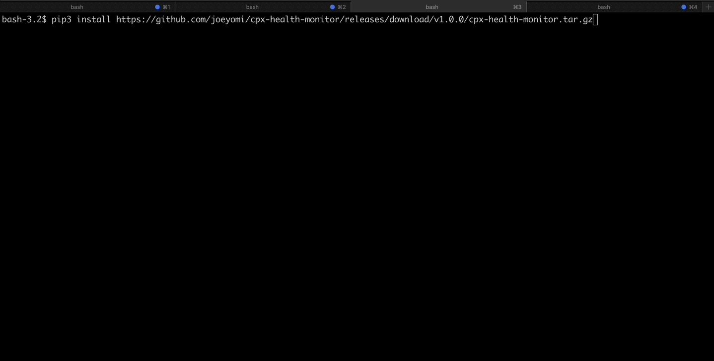

CPX Health Monitor CLI
======================

Command line interface (CLI) tool to monitor the health of Cloud Provider X (CPX) instances

Features
--------

* List and watch CPX instances and services.
* Filter instances and services by name and status.
* Show details of a particular instance or service.

Demo
------------

Installation
------------

To install the CPX Health Monitor CLI, you can use pip to install the tool from a remote tar file.

* First, download the latest version of the tool from the remote tar file:

    .. code-block::

       wget pip install https://github.com/joeyomi/cpx-health-monitor/releases/download/v1.0.0/cpx-health-monitor.tar.gz

* Then, use pip to install the tool from the tar file:

    .. code-block::

       pip install cpx-health-monitor.tar.gz

This will install the cpxstat command line tool and its dependencies in your Python environment. 

Alternatively, you can install the tool directly from a remote URL using pip:

    .. code-block::

       pip install https://github.com/joeyomi/cpx-health-monitor/releases/download/v1.0.0/cpx-health-monitor.tar.gz

Note that you may need to use sudo or run the command as an administrator depending on your system's configuration.

Once installed, you can run the tool using the cpxstat command.

Usage
-----
Start the CPX Server, on your desired port:

    .. code-block::

       python ./cpx_server.py 8085

Export your CPX Server configs as environment variables, example:

    .. code-block::

        export CPX_HEALTH_MONITOR_PROTOCOL=http
        export CPX_HEALTH_MONITOR_HOST=localhost
        export CPX_HEALTH_MONITOR_PORT=8085

These environment variables are not required, they all have defaults:

* CPX_HEALTH_MONITOR_PROTOCOL defaults to "http"
* CPX_HEALTH_MONITOR_HOST defaults to "localhost"
* CPX_HEALTH_MONITOR_PORT defaults to "8085"

To use the CPX Health Monitor CLI, run the following command:

    .. code-block::

       cpxstat [OPTIONS] COMMAND [ARGS]...

The available commands are:

* `instances` : Monitor CPX instances.
* `services` : Monitor CPX services.

For more information on a specific command, use the --help option, for example:

    .. code-block::

       cpxstat instances --help

Limitations
--------

* API endpoint and port is currently hardcoded to "http://localhost:5000"

Next Steps
--------

* Implement configs:
    * YAML config file with API URL and PORT.
* Improve logging.
* Improve Error Handling.

Building
--------

* First, clone this repo:

    .. code-block::

       git clone https://github.com/joeyomi/cpx-health-monitor.git

* Navigate to "./cpx-health-monitor":

    .. code-block::

       cd cpx-health-monitor

* Install dev dependencies:

    .. code-block::

       pip install -r requirements/dev.txt

* Build "tar.gz" package:

    .. code-block::

        python setup.py sdist
        python setup.py bdist_wheel
        ls -l dist

Alternatively, you can install with "make":

    .. code-block::

        make install-e